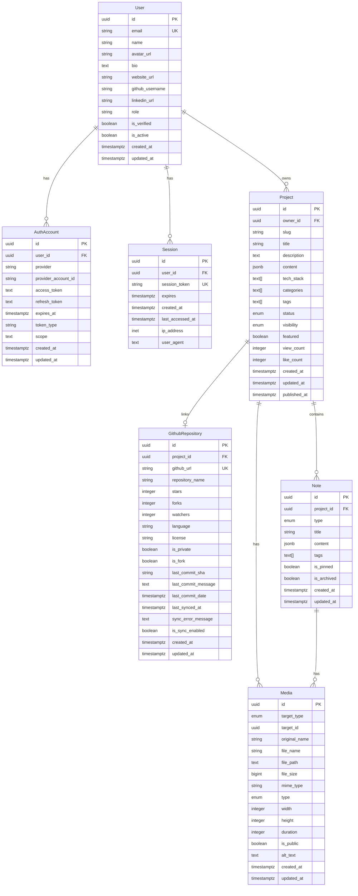

# 데이터베이스 ERD 설계서

## 개요

포트폴리오 매니저 MVP를 위한 PostgreSQL 데이터베이스 스키마 설계입니다.
사용자 중심의 포트폴리오 관리와 좌측 탭 기반 노트 시스템을 지원합니다.

## 핵심 설계 원칙

- **YAGNI 준수**: MVP에 필요한 최소한의 엔티티만 구현
- **확장성 고려**: Phase 2+ 기능 추가를 위한 확장 가능한 구조
- **PostgreSQL 최적화**: JSONB, 배열, 전문검색 등 PostgreSQL 고유 기능 활용
- **성능 우선**: 인덱스 최적화와 쿼리 성능 고려

## 📊 MVP Phase 1 핵심 엔티티

### 1. User (사용자)
전역 사용자 정보 및 프로필 관리

```sql
CREATE TABLE users (
    id UUID PRIMARY KEY DEFAULT gen_random_uuid(),
    email VARCHAR(255) UNIQUE NOT NULL,
    name VARCHAR(100) NOT NULL,
    avatar_url TEXT,
    bio TEXT,
    website_url TEXT,
    github_username VARCHAR(100),
    linkedin_url TEXT,
    role VARCHAR(20) DEFAULT 'user' CHECK (role IN ('user', 'admin')),
    is_verified BOOLEAN DEFAULT FALSE,
    is_active BOOLEAN DEFAULT TRUE,
    created_at TIMESTAMPTZ DEFAULT NOW(),
    updated_at TIMESTAMPTZ DEFAULT NOW()
);

-- 인덱스
CREATE INDEX idx_users_email ON users(email);
CREATE INDEX idx_users_github_username ON users(github_username);
CREATE INDEX idx_users_created_at ON users(created_at);
```

### 2. AuthAccount (소셜 로그인 연동)
외부 인증 제공자 연동 정보

```sql
CREATE TABLE auth_accounts (
    id UUID PRIMARY KEY DEFAULT gen_random_uuid(),
    user_id UUID NOT NULL REFERENCES users(id) ON DELETE CASCADE,
    provider VARCHAR(50) NOT NULL, -- 'github', 'google', 'linkedin'
    provider_account_id VARCHAR(255) NOT NULL,
    access_token TEXT,
    refresh_token TEXT,
    expires_at TIMESTAMPTZ,
    token_type VARCHAR(50),
    scope TEXT,
    created_at TIMESTAMPTZ DEFAULT NOW(),
    updated_at TIMESTAMPTZ DEFAULT NOW(),
    
    UNIQUE(provider, provider_account_id)
);

-- 인덱스
CREATE INDEX idx_auth_accounts_user_id ON auth_accounts(user_id);
CREATE INDEX idx_auth_accounts_provider ON auth_accounts(provider, provider_account_id);
```

### 3. Session (세션 관리)
사용자 세션 및 토큰 관리

```sql
CREATE TABLE sessions (
    id UUID PRIMARY KEY DEFAULT gen_random_uuid(),
    user_id UUID NOT NULL REFERENCES users(id) ON DELETE CASCADE,
    session_token VARCHAR(255) UNIQUE NOT NULL,
    expires TIMESTAMPTZ NOT NULL,
    created_at TIMESTAMPTZ DEFAULT NOW(),
    last_accessed_at TIMESTAMPTZ DEFAULT NOW(),
    ip_address INET,
    user_agent TEXT
);

-- 인덱스
CREATE INDEX idx_sessions_user_id ON sessions(user_id);
CREATE INDEX idx_sessions_token ON sessions(session_token);
CREATE INDEX idx_sessions_expires ON sessions(expires);
```

### 4. Project (포트폴리오 프로젝트)
포트폴리오 프로젝트 메타데이터 및 설정

```sql
CREATE TYPE project_status AS ENUM ('draft', 'active', 'archived', 'deleted');
CREATE TYPE project_visibility AS ENUM ('public', 'private', 'unlisted');

CREATE TABLE projects (
    id UUID PRIMARY KEY DEFAULT gen_random_uuid(),
    owner_id UUID NOT NULL REFERENCES users(id) ON DELETE CASCADE,
    slug VARCHAR(100) NOT NULL, -- URL friendly identifier
    title VARCHAR(200) NOT NULL,
    description TEXT,
    content JSONB, -- 프로젝트 상세 내용 (Markdown, HTML 등)
    
    -- 프로젝트 메타데이터
    tech_stack TEXT[] DEFAULT '{}', -- 기술 스택 배열
    categories TEXT[] DEFAULT '{}', -- 카테고리 태그
    tags TEXT[] DEFAULT '{}', -- 일반 태그
    
    -- 프로젝트 설정
    status project_status DEFAULT 'draft',
    visibility project_visibility DEFAULT 'private',
    featured BOOLEAN DEFAULT FALSE, -- 대표 프로젝트 여부
    
    -- 통계 및 메트릭
    view_count INTEGER DEFAULT 0,
    like_count INTEGER DEFAULT 0,
    
    -- 타임스탬프
    created_at TIMESTAMPTZ DEFAULT NOW(),
    updated_at TIMESTAMPTZ DEFAULT NOW(),
    published_at TIMESTAMPTZ,
    
    -- 제약조건
    UNIQUE(owner_id, slug)
);

-- 인덱스
CREATE INDEX idx_projects_owner_id ON projects(owner_id);
CREATE INDEX idx_projects_slug ON projects(slug);
CREATE INDEX idx_projects_status ON projects(status);
CREATE INDEX idx_projects_visibility ON projects(visibility);
CREATE INDEX idx_projects_featured ON projects(featured) WHERE featured = TRUE;
CREATE INDEX idx_projects_tech_stack ON projects USING GIN(tech_stack);
CREATE INDEX idx_projects_categories ON projects USING GIN(categories);
CREATE INDEX idx_projects_tags ON projects USING GIN(tags);
CREATE INDEX idx_projects_created_at ON projects(created_at);
CREATE INDEX idx_projects_view_count ON projects(view_count);

-- 전문검색 인덱스
CREATE INDEX idx_projects_search ON projects USING GIN(
    to_tsvector('english', title || ' ' || COALESCE(description, ''))
);
```

### 5. GithubRepository (GitHub 저장소 정보)
프로젝트별 GitHub 저장소 메타데이터 (3NF 준수를 위한 분리)

```sql
CREATE TABLE github_repositories (
    id UUID PRIMARY KEY DEFAULT gen_random_uuid(),
    project_id UUID NOT NULL REFERENCES projects(id) ON DELETE CASCADE,
    
    -- GitHub 저장소 정보
    github_url TEXT UNIQUE NOT NULL,
    repository_name VARCHAR(255) NOT NULL, -- owner/repo 형식
    stars INTEGER DEFAULT 0,
    forks INTEGER DEFAULT 0,
    watchers INTEGER DEFAULT 0,
    
    -- 저장소 메타데이터
    language VARCHAR(100), -- 주 언어
    license VARCHAR(100), -- 라이선스
    is_private BOOLEAN DEFAULT FALSE,
    is_fork BOOLEAN DEFAULT FALSE,
    
    -- 커밋 정보
    last_commit_sha VARCHAR(40),
    last_commit_message TEXT,
    last_commit_date TIMESTAMPTZ,
    
    -- 동기화 정보
    last_synced_at TIMESTAMPTZ DEFAULT NOW(),
    sync_error_message TEXT,
    is_sync_enabled BOOLEAN DEFAULT TRUE,
    
    -- 타임스탬프
    created_at TIMESTAMPTZ DEFAULT NOW(),
    updated_at TIMESTAMPTZ DEFAULT NOW(),
    
    -- 제약조건: 1:1 관계 보장
    UNIQUE(project_id)
);

-- 인덱스
CREATE INDEX idx_github_repositories_project_id ON github_repositories(project_id);
CREATE INDEX idx_github_repositories_url ON github_repositories(github_url);
CREATE INDEX idx_github_repositories_sync ON github_repositories(last_synced_at);
CREATE INDEX idx_github_repositories_stars ON github_repositories(stars);
```

### 6. Note (좌측 탭 기반 노트)
프로젝트별 노트 시스템 (학습/변경/조사)

```sql
CREATE TYPE note_type AS ENUM ('learn', 'change', 'research');

CREATE TABLE notes (
    id UUID PRIMARY KEY DEFAULT gen_random_uuid(),
    project_id UUID NOT NULL REFERENCES projects(id) ON DELETE CASCADE,
    type note_type NOT NULL,
    title VARCHAR(200) NOT NULL,
    content JSONB NOT NULL, -- Markdown 또는 구조화된 콘텐츠
    tags TEXT[] DEFAULT '{}',
    
    -- 메타데이터
    is_pinned BOOLEAN DEFAULT FALSE,
    is_archived BOOLEAN DEFAULT FALSE,
    
    -- 타임스탬프
    created_at TIMESTAMPTZ DEFAULT NOW(),
    updated_at TIMESTAMPTZ DEFAULT NOW()
);

-- 인덱스
CREATE INDEX idx_notes_project_id ON notes(project_id);
CREATE INDEX idx_notes_type ON notes(type);
CREATE INDEX idx_notes_pinned ON notes(is_pinned) WHERE is_pinned = TRUE;
CREATE INDEX idx_notes_tags ON notes USING GIN(tags);
CREATE INDEX idx_notes_created_at ON notes(created_at);

-- 전문검색 인덱스
CREATE INDEX idx_notes_search ON notes USING GIN(
    to_tsvector('english', title || ' ' || (content->>'text'))
);
```

### 7. Media (미디어 파일)
프로젝트 및 노트 첨부 미디어

```sql
CREATE TYPE media_target_type AS ENUM ('project', 'note');
CREATE TYPE media_type AS ENUM ('image', 'video', 'document', 'archive');

CREATE TABLE media (
    id UUID PRIMARY KEY DEFAULT gen_random_uuid(),
    target_type media_target_type NOT NULL,
    target_id UUID NOT NULL, -- project.id 또는 note.id
    
    -- 파일 정보
    original_name VARCHAR(255) NOT NULL,
    file_name VARCHAR(255) NOT NULL, -- 저장된 파일명
    file_path TEXT NOT NULL, -- 저장 경로
    file_size BIGINT NOT NULL, -- bytes
    mime_type VARCHAR(100) NOT NULL,
    type media_type NOT NULL,
    
    -- 이미지/비디오 메타데이터
    width INTEGER,
    height INTEGER,
    duration INTEGER, -- 비디오 길이 (초)
    
    -- 설정
    is_public BOOLEAN DEFAULT FALSE,
    alt_text TEXT, -- 접근성을 위한 대체 텍스트
    
    -- 타임스탬프
    created_at TIMESTAMPTZ DEFAULT NOW(),
    updated_at TIMESTAMPTZ DEFAULT NOW()
);

-- 인덱스
CREATE INDEX idx_media_target ON media(target_type, target_id);
CREATE INDEX idx_media_type ON media(type);
CREATE INDEX idx_media_created_at ON media(created_at);

-- 외래키 제약조건은 애플리케이션 레벨에서 관리
-- (target_type에 따라 다른 테이블 참조)
```

## 🔄 엔티티 관계도



## 📈 Phase 2+ 확장 엔티티 (MVP 이후)

### Site (배포된 사이트)
```sql
-- Phase 2에서 추가
CREATE TABLE sites (
    id UUID PRIMARY KEY DEFAULT gen_random_uuid(),
    project_id UUID NOT NULL REFERENCES projects(id) ON DELETE CASCADE,
    subdomain VARCHAR(100) UNIQUE NOT NULL,
    custom_domain VARCHAR(255),
    deployed_at TIMESTAMPTZ,
    status VARCHAR(20) DEFAULT 'pending',
    build_log TEXT,
    created_at TIMESTAMPTZ DEFAULT NOW(),
    updated_at TIMESTAMPTZ DEFAULT NOW()
);
```

### Deployment (배포 이력)
```sql
-- Phase 2에서 추가
CREATE TABLE deployments (
    id UUID PRIMARY KEY DEFAULT gen_random_uuid(),
    project_id UUID NOT NULL REFERENCES projects(id) ON DELETE CASCADE,
    env VARCHAR(20) NOT NULL, -- 'local', 'staging', 'production'
    status VARCHAR(20) DEFAULT 'pending',
    url TEXT,
    build_time INTEGER, -- 빌드 시간 (초)
    error_message TEXT,
    created_at TIMESTAMPTZ DEFAULT NOW(),
    completed_at TIMESTAMPTZ
);
```

### SearchIndex (검색 인덱스)
```sql
-- Phase 3에서 추가 (Elasticsearch 대신 PostgreSQL 전문검색)
CREATE TABLE search_index (
    id UUID PRIMARY KEY DEFAULT gen_random_uuid(),
    target_type VARCHAR(20) NOT NULL, -- 'project', 'note'
    target_id UUID NOT NULL,
    content TSVECTOR NOT NULL,
    created_at TIMESTAMPTZ DEFAULT NOW(),
    updated_at TIMESTAMPTZ DEFAULT NOW()
);

CREATE INDEX idx_search_content ON search_index USING GIN(content);
```

## 🎯 데이터베이스 마이그레이션 전략

### 1. 초기 마이그레이션 (MVP)
```sql
-- 001_initial_schema.sql
-- 위의 모든 MVP 테이블 생성
```

### 2. 데이터 시딩
```sql
-- 002_seed_data.sql
-- 개발용 샘플 데이터 삽입
```

### 3. 향후 마이그레이션
- `003_add_sites_table.sql` - Phase 2
- `004_add_deployments_table.sql` - Phase 2  
- `005_add_search_index.sql` - Phase 3

## ✅ 정규화 준수 사항

### 제3정규화 (3NF) 완전 준수
- **1NF**: 모든 속성이 원자값 (배열/JSONB는 PostgreSQL 고유 기능)
- **2NF**: 부분 함수 종속성 제거 (모든 비주키 속성이 기본키 전체에 완전 함수 종속)
- **3NF**: 이행적 함수 종속성 제거 (GitHub 정보를 별도 테이블로 분리)

### 주요 정규화 결정
1. **GitHub 정보 분리**: `projects` ↔ `github_repositories` (1:1)
2. **엔티티 독립성**: 각 테이블이 단일 책임 원칙 준수
3. **참조 무결성**: 외래키 제약조건으로 데이터 일관성 보장

## 🔧 PostgreSQL 최적화 전략

### 1. JSONB 활용
- `projects.content`: 유연한 프로젝트 콘텐츠 저장
- `notes.content`: Markdown, 구조화된 노트 콘텐츠
- 인덱싱 가능하면서 스키마 변경 없이 확장 가능

### 2. 배열 타입 활용  
- `tech_stack`, `categories`, `tags`: PostgreSQL 네이티브 배열
- GIN 인덱스로 효율적인 검색 지원

### 3. 전문검색 (Full-Text Search)
- `to_tsvector()` 함수로 영어 텍스트 검색
- GIN 인덱스로 성능 최적화
- Phase 3에서 Elasticsearch 대체 가능

### 4. UUID 기본키
- 분산 시스템 대응
- 보안성 향상 (ID 추측 불가)
- URL에 노출되어도 안전

### 5. 1:1 관계 최적화
- `github_repositories.project_id`에 UNIQUE 제약조건
- LEFT JOIN으로 선택적 조회 최적화

## 📊 예상 성능 지표

### MVP 단계 추정
- **사용자 수**: ~100명
- **프로젝트 수**: ~500개
- **노트 수**: ~2,000개
- **미디어 파일**: ~1,000개
- **동시 접속**: ~10명

### 쿼리 성능 목표
- 프로젝트 목록 조회: <100ms
- 노트 검색: <200ms  
- 프로젝트 상세 조회: <50ms
- 미디어 업로드: <5초

## 🔐 보안 고려사항

1. **Row Level Security (RLS)** 활용 검토
2. **민감 정보 암호화**: access_token, refresh_token
3. **감사 로그**: 중요 데이터 변경 이력 추적
4. **백업 전략**: 일일 자동 백업 + 주간 풀 백업

---

**다음 단계**: API 엔드포인트 기본 설계 문서 작성